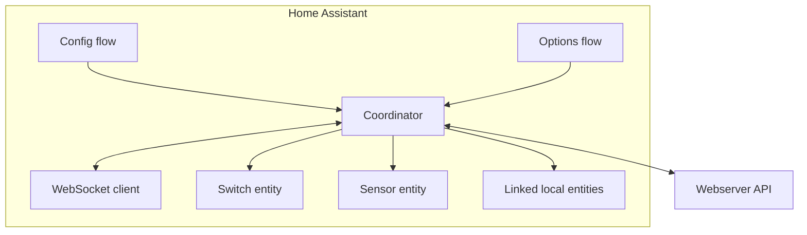
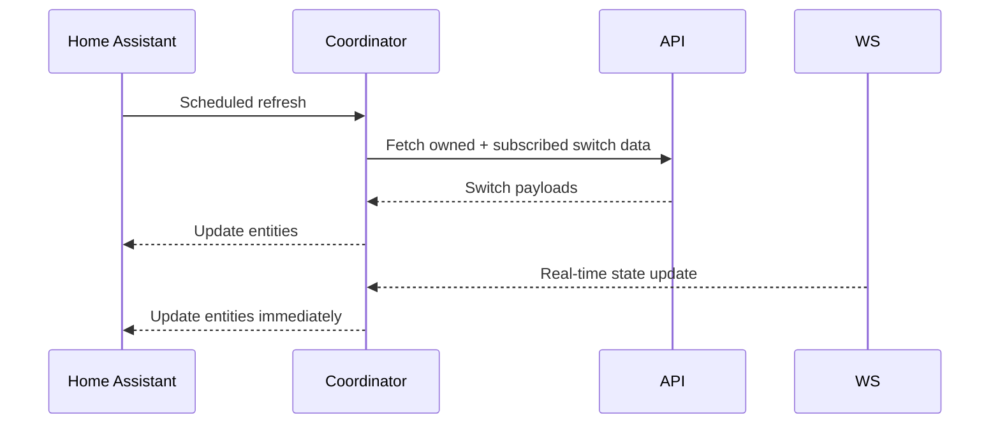
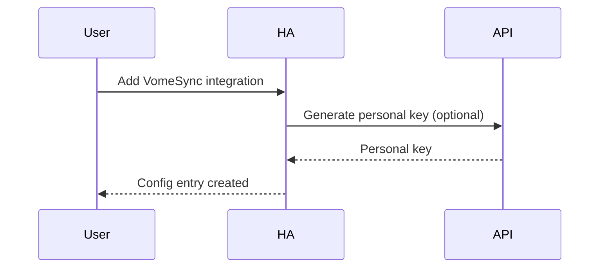
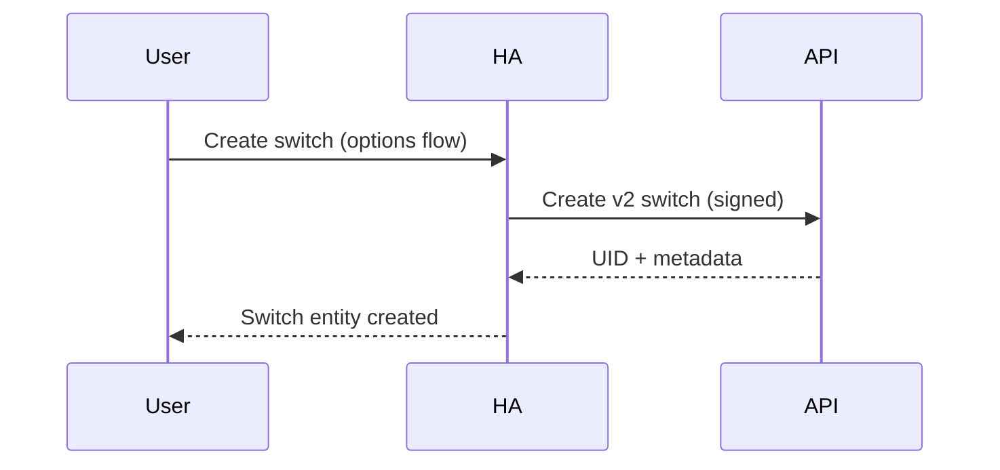
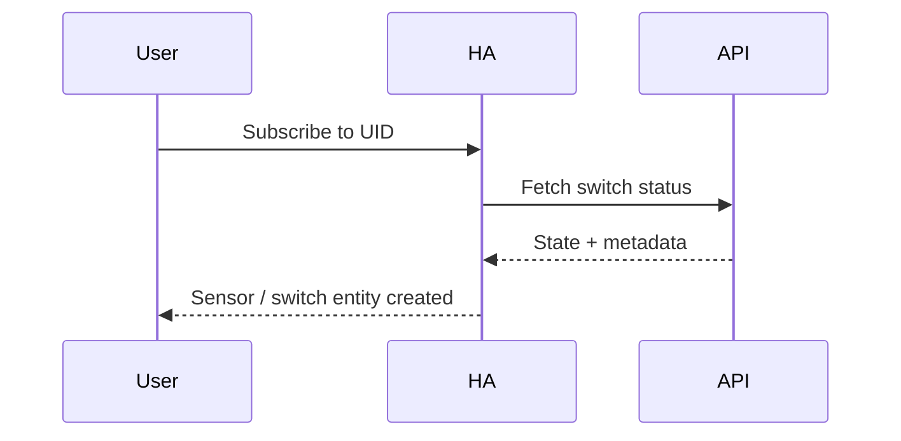
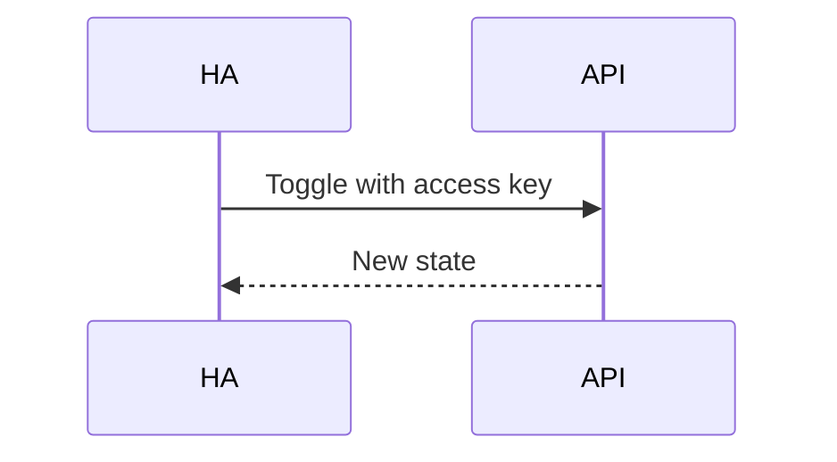
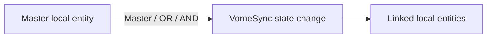
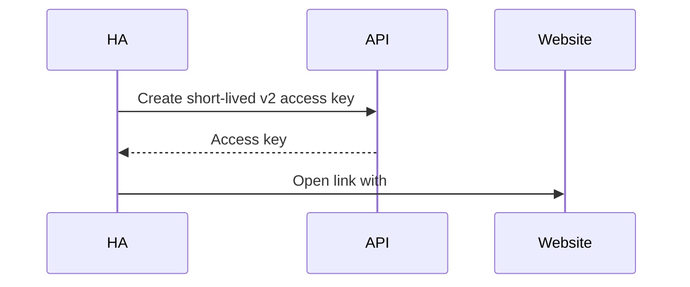

# Home Assistant Integration Architecture (Public‑Safe)

This document details the **Home Assistant integration** design and options flow, without sensitive specifics.

## 1) Components



## 2) Update Cycle (Simplified)



## 2.1) Config Flow (Initial Setup)



## 2.2) Create Switch (v2)



## 2.3) Subscribe to Switch



## 2.4) Access‑Key Toggle (Subscription)



## 3) Entity Types

- **Switch entity**: created for owners and for subscriptions with an access key.
- **Sensor entity**: used for listen‑only subscriptions (read‑only state).
- **Both** entities share the same device identifiers so they group together.

## 3.1) Ownership vs Subscriptions

- **Owners** can toggle and update metadata through signed v2 requests.
- **Subscriptions** are read‑only unless a delegated access key is provided.
- **Access keys** enable per‑switch toggling without full ownership.

## 4) Options Flow Menu Map

```mermaid
flowchart TD
	Init[Options menu]
	More[More...]
	Manage[Manage switches]
	ActionMenu[Switch actions]

	Init --> Create[Create switch]
	Init --> Subscribe[Subscribe to switch]
	Init --> Manage
	Init --> More

	Manage --> ActionMenu
	ActionMenu --> View[View details]
	ActionMenu --> Edit[Edit settings (owners)]
	ActionMenu --> Keys[Access keys (owners, v2)]
	ActionMenu --> Website[Manage on website (owners, v2)]
	ActionMenu --> Link[Link local entities]
	ActionMenu --> Delete[Delete switch (owners)]
	ActionMenu --> Remove[Remove from this installation]

	More --> Backup[Backup signing key]
	More --> Import[Import switches]
	More --> Reannounce[Re‑announce owned switches]
	More --> Cleanup[Clean up orphaned devices]
	More --> EditURLs[Edit connection URLs]
	More --> Back[Back]
	Back --> Init
```

## 5) Linking Local Entities (Behaviour)



Notes:
- **Listen‑only switches** hide the direction selector and force **switch → entities**.
- Linking supports **Master**, **OR**, or **AND** behaviour for multiple entities.
- Linked local entities are never shared outside the local HA instance.

## 6) Caching and Startup Behaviour

- The integration caches imported switches in options for fast startup.
- On refresh, the coordinator updates cache with the latest API data.
- If the API is slow or unavailable, cached entities still appear in HA.

## 7) Manage on Website (Owner)



Notes:
- Website management links use **short‑lived** access keys by default.
- “Stay logged in” extends the session up to **30 days** (max).

